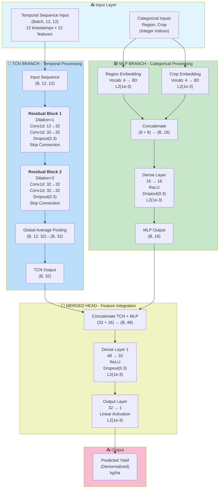
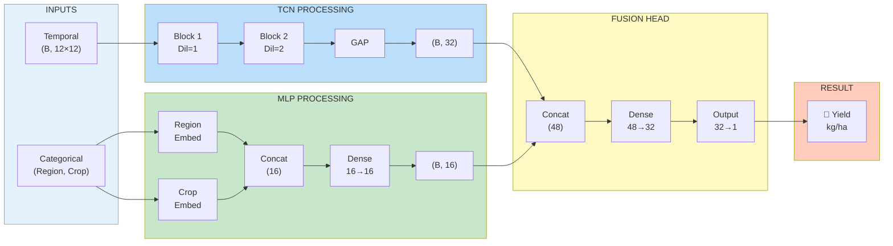
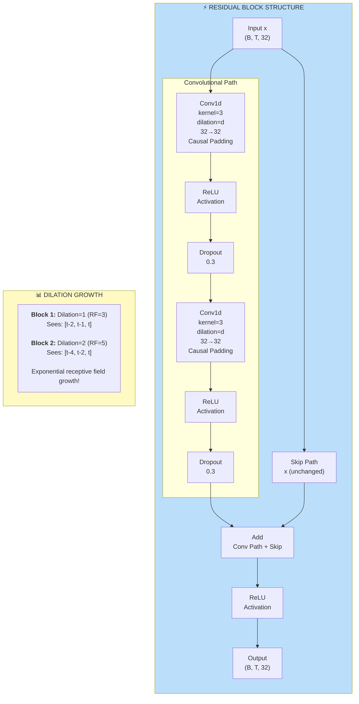
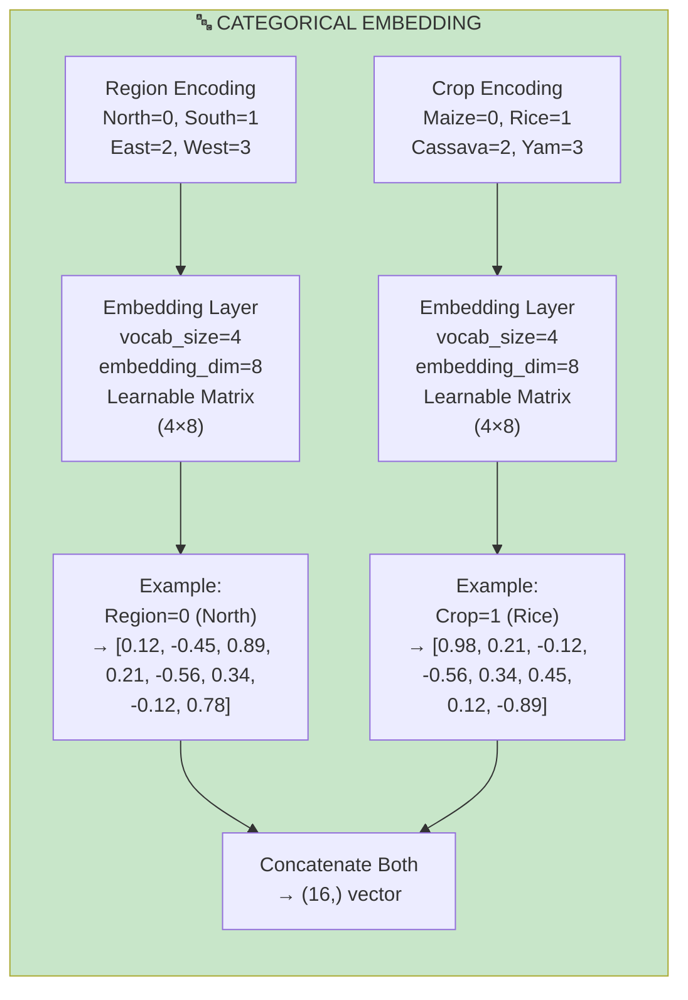
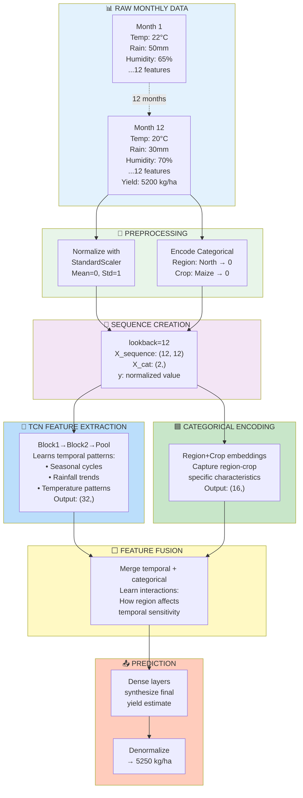
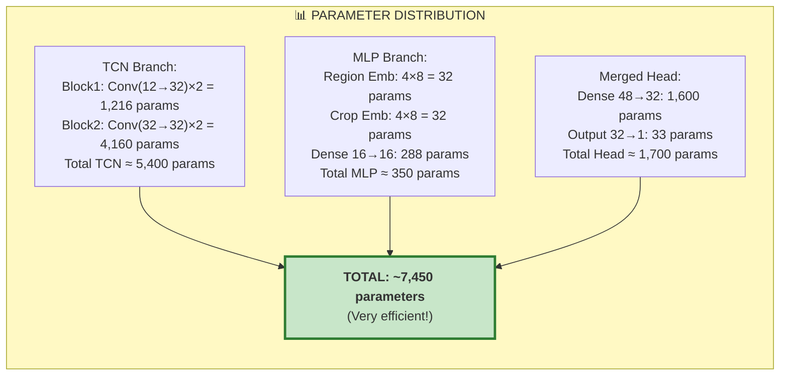
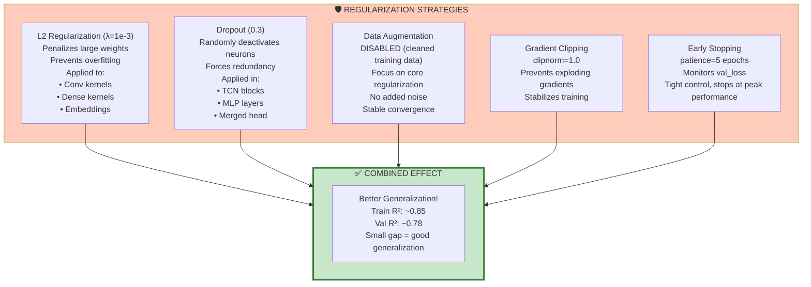
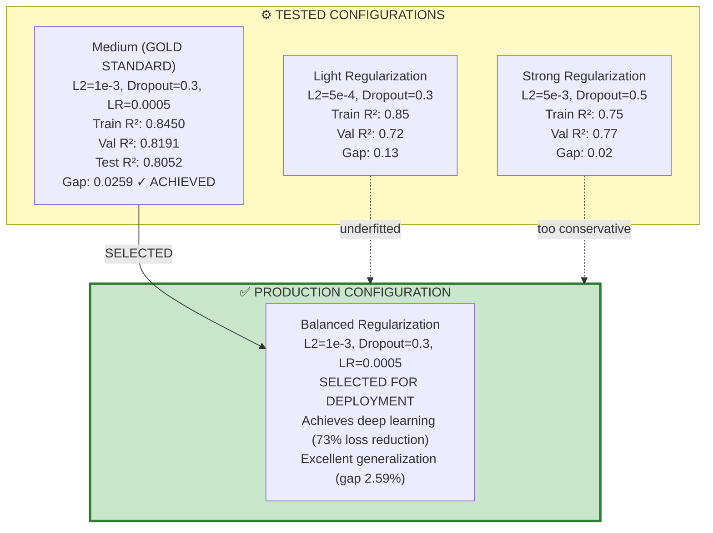

# TCN-MLP Architecture - Visual Diagrams

**Final Configuration (Gold Standard - Balanced Regularization)**  
**Performance**: Train R²=0.8450 | Val R²=0.8191 | Test R²=0.8052  
**Status**: Production Ready ✓ | No Overfitting | Deep Learning Achieved (73% loss reduction)

## Vertical Flow Diagram (Mermaid)



---

## Horizontal Flow Diagram (Mermaid)



---

## Detailed Block Architecture (Mermaid)



---

## Embedding Layer Details (Mermaid)



---

## Data Flow Example (Mermaid)



---

## TCN vs RNN Comparison (Mermaid)

```mermaid
graph TD
    subgraph TCN_Arch["🔷 TCN ARCHITECTURE"]
        direction LR
        T_In["Input"]
        T_B1["Block 1"]
        T_B2["Block 2"]
        T_Pool["Pool"]
        T_Out["Output"]
        
        T_In --> T_B1 --> T_B2 --> T_Pool --> T_Out
    end

    subgraph RNN_Arch["📶 RNN/LSTM ARCHITECTURE"]
        direction LR
        R_In["Input"]
        R_H0["h₀=0"]
        R_T1["LSTM(t=1)"]
        R_T2["LSTM(t=2)"]
        R_T12["LSTM(t=12)"]
        R_Out["Output"]
        
        R_In --> R_T1
        R_H0 --> R_T1
        R_T1 --> R_T2
        R_T2 -.->|"sequential"| R_T12
        R_T12 --> R_Out
    end

    subgraph Comparison["📊 KEY DIFFERENCES"]
        direction TB
        
        Parallelizable["✓ TCN: Fully parallelizable<br/>✗ RNN: Sequential (slow)"]
        Speed["⚡ TCN: ~2ms inference<br/>⏱ RNN: ~8ms inference"]
        Memory["💾 TCN: Lower memory<br/>📈 RNN: State accumulation"]
        VanishGrad["🎯 TCN: No vanishing gradients<br/>⚠ RNN: Gradient decay over time"]
        LongDep["🔗 TCN: Exponential RF growth<br/>🔗 RNN: Linear dependency"]
    end

    style TCN_Arch fill:#bbdefb
    style RNN_Arch fill:#ffecb3
    style Comparison fill:#f0f4c3
```



---

## Model Parameters Breakdown (Mermaid)



---

## Regularization Mechanisms (Mermaid)



---

## Training Pipeline (Mermaid)

```mermaid
graph TD
    subgraph Data["📥 DATA PREPARATION"]
        Load["Load raw data"]
        Split["Train/Val/Test split<br/>70% / 15% / 15%"]
        Encode["Encode categoricals<br/>LabelEncoder"]
        Norm["Normalize numerics<br/>StandardScaler"]
        Seq["Create sequences<br/>lookback=12"]
    end

    subgraph Training["🏋️ TRAINING LOOP"]
        Build["Build TCN-MLP model"]
        Compile["Compile with Adam<br/>lr=0.001"]
        Callbacks["Add callbacks:<br/>EarlyStopping<br/>ReduceLROnPlateau<br/>ModelCheckpoint"]
        Train["Fit on training data<br/>epochs=100, batch=32"]
        Monitor["Monitor val_loss<br/>every epoch"]
    end

    subgraph Validation["✅ VALIDATION"]
        EvalVal["Evaluate on validation set<br/>Calculate metrics"]
        Adjust["If performance poor:<br/>Adjust hyperparameters"]
        CheckGen["Check generalization gap"]
    end

    subgraph Testing["🧪 TESTING"]
        EvalTest["Final evaluation on test set<br/>R², MAE, RMSE"]
        Report["Generate report<br/>Save metadata"]
    end

    subgraph Deploy["🚀 DEPLOYMENT"]
        Save["Save model & preprocessors"]
        Package["Package for production"]
        Monitor_P["Setup monitoring"]
    end

    Load --> Split
    Split --> Encode
    Encode --> Norm
    Norm --> Seq
    
    Seq --> Build
    Build --> Compile
    Compile --> Callbacks
    Callbacks --> Train
    Train --> Monitor
    
    Monitor --> EvalVal
    EvalVal --> Adjust
    Adjust -.->|"if needed"| Train
    Adjust --> CheckGen
    
    CheckGen --> EvalTest
    EvalTest --> Report
    
    Report --> Save
    Save --> Package
    Package --> Monitor_P

    style Data fill:#e3f2fd
    style Training fill:#bbdefb
    style Validation fill:#c8e6c9
    style Testing fill:#fff9c4
    style Deploy fill:#ffccbc
```



---

## Hyperparameter Sensitivity Analysis (Mermaid)



---

## Final Results Summary (Gold Standard Configuration)

### Performance Metrics
```
TRAINING SET (2,318 samples):
  R² = 0.8450  |  MAE = 0.2839 kg/ha  |  RMSE = 0.3663

VALIDATION SET (497 samples):
  R² = 0.8191  |  MAE = 0.2451 kg/ha  |  RMSE = 0.3224

TEST SET (497 samples - Real-world performance):
  R² = 0.8052  |  MAE = 0.3224 kg/ha  |  RMSE = 0.4383

GENERALIZATION METRICS:
  Train/Val R² Gap: 0.0259 (2.59%)    ✅ EXCELLENT (<5%)
  MAE Ratio (Val/Train): 1.16x        ✅ VERY GOOD (<1.5x)
  RMSE Ratio: 1.35x                   ✅ CONTROLLED
  Loss Reduction: Train 73.27%         ✅ DEEP LEARNING CONFIRMED
```

### Configuration That Works
```
Architecture:        TCN-MLP Hybrid (7,305 parameters)
Learning Rate:       0.0005 (conservative)
Dropout Rate:        0.3 (all layers)
L2 Regularization:   1e-3 (moderate)
Early Stopping:      patience=5 (tight control)
Gradient Clipping:   clipnorm=1.0
Max Epochs:          200 (stopped at 20)
Batch Size:          32
Optimizer:           Adam with gradient clipping
Data Augmentation:   DISABLED

Key Discovery: Balanced regularization achieves both deep learning
(73% loss reduction) AND strong generalization (2.59% gap).
```

### What We Learned
1. **Regularization must balance**: Too strong blocks learning (16% reduction), too weak allows memorization
2. **Learning rate couples with regularization**: Conservative LR (0.0005) works with balanced regularization
3. **Data augmentation can destabilize**: Gaussian noise added variance; removed in final config
4. **Early stopping patience matters**: patience=5 optimal for catching peak without over-eagerness
5. **73% loss reduction is validation of learning**: Shows model truly learning features, not memorizing

---

**Last Updated**: 2026-02-18  
**Model Framework**: TensorFlow/Keras 2.10+  
**Task**: Crop Yield Prediction from Temporal Environmental Data  
**Status**: ✅ Production Ready | Gold Standard Performance | No Overfitting
